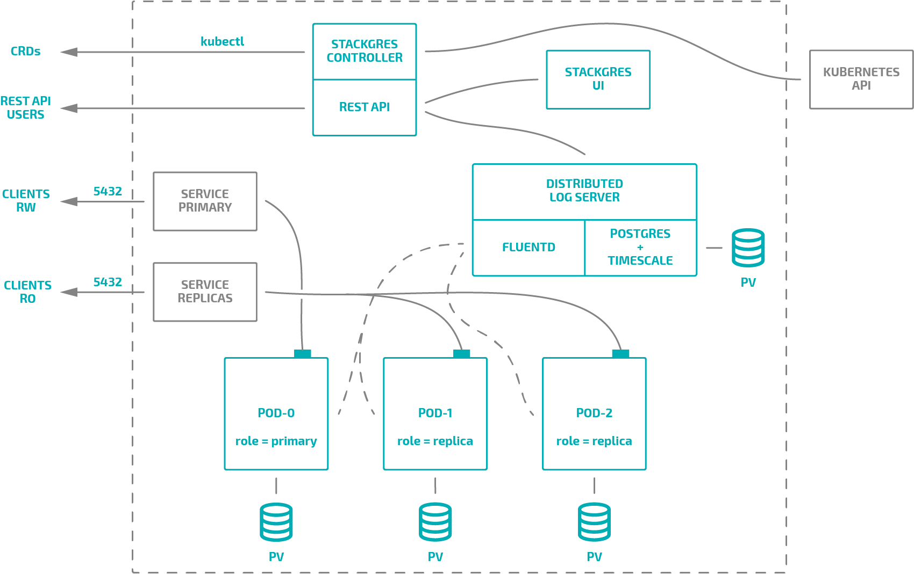
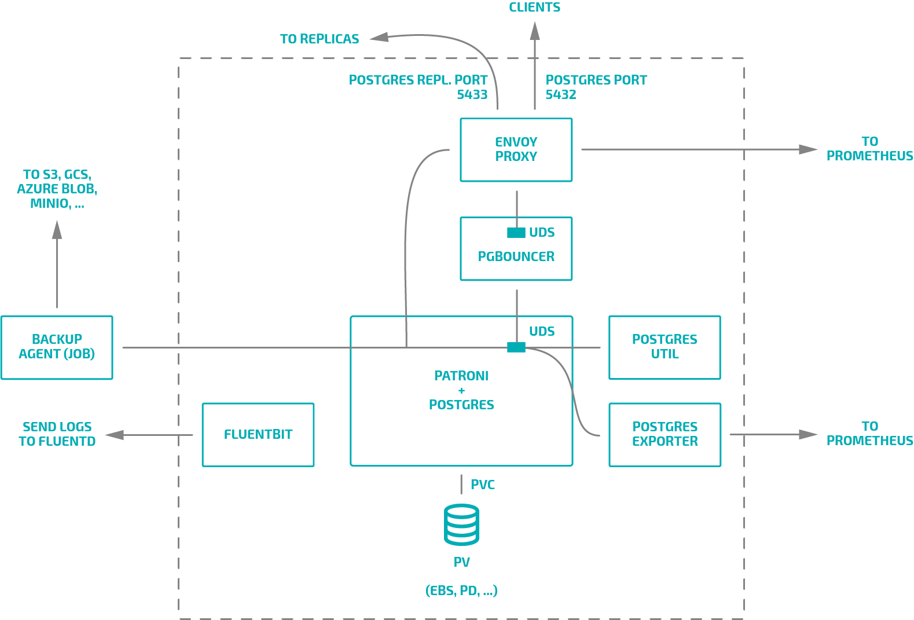

## The Operator

An Operator is a method of packaging, deploying and managing a Kubernetes
application. Some applications, such as databases, required more hand-holding, and a cloud-native
Postgres requires an operator to provide additional knowledge of how to maintain state and integrate
all the components. The StackGres operator allow to deploy a StackGres cluster using a few custom
resources created by the user.

## Operator availability concerns

Operator availability only affect operational plane, data plane is not affected
 at all since the database will work as expected when the operator is offline.
 There is a best effort in maintaining the operator available. It is expected
 that if at some point the operator is unavailable and this could lead to
 unavailability of following operational aspects:

* Cluster creation / update
* Cluster configuration creation / update / deletion
* Backups generation
* Reconciliation of modified resources controlled by the operator (when
 modified by the user or some other means)

Operator unavailability does not affect following functional aspects:

* Database high availability
* Connection pooling
* Incremental backups
* Stats collection

## The Cluster

A StackGres cluster is basically a StatefulSet where each pod is a database instance. The
 StatefulSet guarantees that each pod is always bind to its own persistent volume therefore the
 database instance data will be mapped to the state of a patroni instance inside kubernetes.

### StackGres Cluster Architecture diagram

### StackGres Pod Architecture diagram

We use a pattern called sidecar where a main application run in a container and other container
 are providing a side functionality like connection pooling, export of stats, edge proxying,
 logging dispatcher or database utilities.
 

> **UDS:** [Unix Domain Socket](https://en.wikipedia.org/wiki/Unix_domain_socket)

