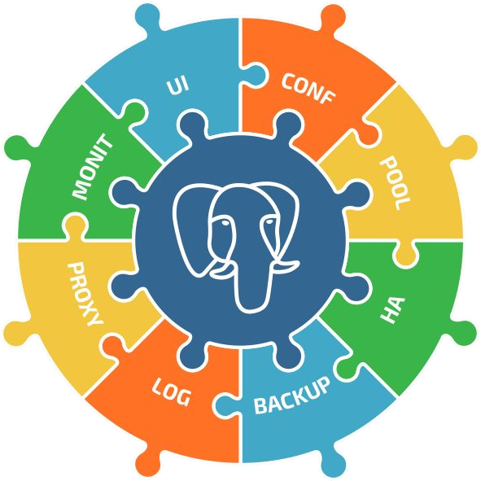

# Components of the Stack

Running Postgres in production requires "a RedHat" of PostgreSQL. A curated set of open source components built,
verified and packaged together. Postgres is like the Linux kernel!

Exists an ecosystem of tools built around Postgres that can be used to build a production ready Postgres. This is what
we call a stack of components.

Chose the right component of the stack is a hard task. Exists many components that overlap functionalities or have
pros and cons that have to be take into account before chosing one or another. It is required an high understanding
of all the components in order to chose the right one.

## Core

The main container used for a Postgres cluster node uses an UBI 8 minimal image as its base to which is added a
vanilla PostgreSQL v11, v12. It uses a persistent storage configured via StorageClass. Is always deployed with a
sidecar util container to allow access for a system/database admisitrator.

## Configuration

Run PostgreSQL using default configuration is a really bad idea in a production environment. PostgreSQL uses very
conservative defaults so it must be tuned in order to achieve good performance of the database. Exists some places
where you can find information about Postgres configuration parameters and best practices:

* [Postgres Official Documentation](https://www.postgresql.org/docs/)
* [https://postgresqlco.nf](https://postgresqlco.nf) (see [PostgreSQL Configuration for Humans](https://speakerdeck.com/ongres/postgresql-configuration-for-humans))
* [The Internals of PostgreSQL](http://www.interdb.jp/pg/)

StackGres is tuned by default to achieve better performance than using the default configuration. User can still
be configured by user in order to give the flexibility that some users needs.

## Connection pooling

Connecting directly to PostgreSQL does not scale very well.

{}pg_bench, scale 2000, m4.large (2 vCPU, 8GB RAM, 1k IOPS){}

Connection pooling is required in order to not saturate PostgreSQL processes by creating queue of sessions, transactions
or statements (depending on the application requirements).

Exists 3 alternatives solutions:

* [PgPool](https://www.pgpool.net)
* [PgBouncer](https://www.pgbouncer.org/)
* [Odyssey](https://github.com/yandex/odyssey)

Which one to chose?

And, where should the connection pooling be placed?

* Client-side
* Server-side
* Middle-ware
* Some or all of the above

## High availability

If a Postgres instance goes down or is not working properly we want our cluster to recover by chosing a working instance
to convert to the new master and configure all the other instances and the application to point to this new master. We want
all this to happen without manual intervention.

A high availability solution allow to achieve this feature. Exists many solutions to this problem and is really hard to chose
one among them:

* [PgPool](https://www.pgpool.net)
* [Repmgr](https://repmgr.org/)
* [Patroni](https://github.com/zalando/patroni)
* [pg_autofailover](https://github.com/citusdata/pg_auto_failover)
* [PAF](https://dalibo.github.io/PAF/)
* [Stolon](https://github.com/sorintlab/stolon)

## Backup and disaster recovery

Backup tools solutions are also a very higly populated ecosystem:

* ~~pg_dump~~
* [Barman](https://www.pgbarman.org/)
* [PgBackrest](https://pgbackrest.org/)
* [Wal-e](https://github.com/wal-e/wal-e) / [Wal-g](https://github.com/wal-g/wal-g)
* [pg_probackup](https://github.com/postgrespro/pg_probackup)

Also, where do we store our backups?

* Disk
* Cloud storage

And finally, will our backup work when needed or will it fail?

## Log

We want to sotre our logs distributed across all our containers in a central location and be able to analyze them when
needed. It does not exists a good solution for that so you have to build one. Exists [fluentd](https://www.fluentd.org/)
and [Loki](https://grafana.com/oss/loki/), this last does not work very well with Postgres. An alternative is to store
all the logs in Postgres using [Timescale](https://github.com/timescale/timescaledb).

## Proxy

How do I locate the master, if it might be changing? How do I obtain traffic metrics? It is possible to manage traffic:
duplicate, A/B to test cluster or event inspect it?

* [Envoy](https://www.envoyproxy.io/): open source edge and service proxy, designed for cloud-native applications

## Monitoring

Which monitoring solution can we use to monitor a Postgres cluster?

* [Zabbix](https://www.zabbix.com/)
* [Okmeter](https://okmeter.io/)
* [Pganalyze](https://pganalyze.com/)
* [Pgwatch2](https://github.com/cybertec-postgresql/pgwatch2)
* [PoWA](https://github.com/powa-team/powa)
* [New Relic](https://newrelic.com/)
* [DataDog](https://www.datadoghq.com/)
* [Prometheus](https://prometheus.io/)

* [PostgreSQL Server Exporter](https://github.com/wrouesnel/postgres_exporter): Prometheus exporter for PostgreSQL server metrics.

## User interface

Exists some user interface to interact with Postgres like pgadmin or dbviewer that allow to look at the database content
and configuration. We need a user interface that is capable of manage an entire cluster. How I list the clusters? How many
nodes have a cluster? What is the status of replication? How many resources are used by a node? How to get monitoring info 
of a particular node?

Some tools exists like:

* [ClusterControl](https://severalnines.com/product/clustercontrol/clustercontrol-community-edition)
* [Elephant Shed](https://elephant-shed.io/)

